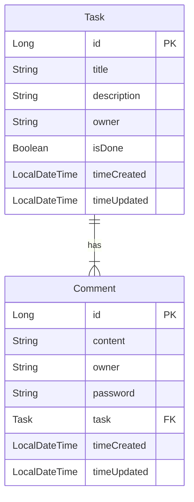

<p align = "center">
    
    
</p

# T o d o S e r v e r

# 개발 환경

| 기준  | 내용                                                                                                  |
|-----|-----------------------------------------------------------------------------------------------------|
| OS  | `Windows 11 Home 23H2`                                                                              |
| IDE | `IntelliJ IDEA 2024.1.1`                                                                            |
| SDK | 개발 언어: `Kotlin 1.9.23`(JVM: `OpenJDK 17.0.3`)<br/>프레임워크: `Spring Boot 3.2.5`<br/>빌드 툴: `Gradle 8.7` |

# 목차
<!-- TOC -->
* [1. 과제 요구사항](#1-과제-요구사항)
* [2. 고민거리(과제 제출 시 같이 써야 하는 질문들)](#2-고민거리과제-제출-시-같이-써야-하는-질문들)
* [3. 데이터베이스](#3-데이터베이스)
  * [3-1. Entity Relationship Diagram (ERD)](#3-1-entity-relationship-diagram-erd)
  * [3-2. 데이터베이스 테이블](#3-2-데이터베이스-테이블)
* [4. API 명세서](#4-api-명세서)
  * [4-1. API call](#4-1-api-call)
  * [4-2. API Call에 이용하는 Data Transfer Object (`DTO`)](#4-2-api-call에-이용하는-data-transfer-object-dto)
<!-- TOC -->

# 1. 과제 요구사항

<details> <summary>1-1. Step 1 (필수)</summary>

- 할 일(`task`) 관련 `CRUD` 기능 추가
  - [v] 할 일 작성
      - `할 일 제목`, `할 일 내용`, `작성일`, `작성자 이름` 저장
      - 추가된 `할 일` 정보 확인 가능
  - [v] 할 일 조회
      - 선택한 할 일 정보 조회
      - `할 일 제목`, `할 일 내용`, `작성일`, `작성자 이름` 포함
  - [v] 할 일 _목록_ 조회
      - 등록된 전체 할 일 목록 조회
      - 작성일 기준 *내림차순* 정렬
  - [v] 할 일 수정
      - `할 일 제목`, `작성자명`, `작성 내용` 수정
      - 수정된 정보 확인 가능
  - [v] 할 일 삭제
      - 선택한 할 일 삭제

</details>

<details> <summary>1-2. Step 2 (선택)</summary>

- 댓글(`comment`) 관련 `CRUD` 기능 추가
  - [v] 댓글 작성
    - 댓글 추가 후 추가된 댓글 정보를 `response`로 반환(비밀번호는 _제외_ 해야 함)
    - 댓글 달 대상 `할 일`의 존재 여부 확인
    - 댓글 내용 이외에 작성자 정보(이름, 비밀번호) 추가로 받기
  - [v] 댓글 수정 
    - 댓글 수정 후 _수정된_ 댓글 정보를 `response`로 반환(비밀번호는 _제외_ 해야 함)
    - 댓글의 존재 유무 확인
    - 대상 댓글의 작성자 정보(이름, 비밀번호)와 `request`로 들어온 작성자 정보 일치 여부 확인
  - [v] 댓글 삭제
    - 댓글 삭제 후 성공 여부 반환
    - 댓글의 존재 유무 확인
    - 대상 댓글의 작성자 정보(이름, 비밀번호)와 `request`로 들어온 작성자 정보 일치 여부 확인
- 할 일(`task`) 관련 기능 보강
  - [v] 할 일 완료 여부 기능 추가
    - 할 일 추가 시 기본적으로 `FALSE`로 설정
  - [v] '할 일 조회' 기능에 연관 댓글 목록 추가

</details>

<details> <summary>1-3. Step 3 (선택)</summary>

- [v] 할 일(`task`) 목록 조회(`GET /api/tasks`) 기능 보강
  - 할 일 작성일을 기준으로 오름차순/내림차순 정렬하는 기능 추가
  - 작성자 이름 포함 시 해당 작성자가 작성한 할 일만 포함하는 기능 추가
- [v] 할 일(`task`) 관련 무결성 검사 기능 추가
  - 할 일 추가/수정 시 제목/내용에 길이 제한(각각 [1, 200], [1, 1000]) 추가
  - 제한을 어길 경우 추가/수정 요청을 받아들이지 않게 처리
- [v] `ResponseEntity`를 사용하여 `API Call`의 응답 코드 반환

</details>


# 2. 고민거리(과제 제출 시 같이 써야 하는 질문들)

<details> <summary>2-1. @ Step 1</summary>

- 2-1-1. 수정/삭제 API의 `request` 사용 방식

  - 특정 `task`를 수정/삭제할 경우 `URL Path`에 `taskId`를 넣어 수정/삭제할 대상 지정
  - `task` 수정 시 `Body` 속에 `DTO` `UpdateTaskRequest`를 보관하여 사용(`@RequestBody`)

- 2-1-2. RESTful API

  - HTTP Method를 통해서*만* 행동을 표현하고, 그 이외의 자원/URI 경로에 대해선 모두 통일(`/api/tasks`)
  - *특정* `task` 조회 및 수정 및 삭제에 대해선 바로 아래에 ID를 경로로 삽입(`/{taskId}`)

- 2-1-3. 관심사 분리

  - `Entity`: DB에 저장할 자료
  - `Repository`: `Entity`에 접근하기 위해 사용
  - `Service`: 실질적인 `Task` 추가/조회/수정/삭제 내용 구현
  - `Controller`: 서버에 들어오는 요청에 대해 대응

- 2-1-4. API 명세서 작성 가이드라인

</details>

<details> <summary>2-2. @ Step 2</summary>

- 2-2-1. 처음 설계했던 API 명세서에 발생한 변경사항

  - 할 일(`task`) 관련
    - 특정 `task` 조회(`GET /api/tasks/{taskId}`) 시 달린 댓글도 추가로 `response`로 반환해야 했었음
  - 댓글(`comment`) 관련 내용들이 추가됨

- 2-2-2. ERD 설계 후 Entity 구현 시 도움이 된 부분들

  - ~~`Entity` 구현 시 타입에 대한 고민을 하지 않아도 됐었다 (빠른 구현)~~

- 2-2-3. 댓글이 여러 개 달려 있는 할 일을 삭제하려고 할 경우 데이터베이스 테이블 관점에서 발생할 수 있는 문제

  - 할 일(`task`)에 달린(관계를 맺은) 댓글(`comment`)들도 _모두_ 삭제해줘야 함(`orphanRemoval` 특성을 주는 것으로 해결 가능)
    - 상상할 수 있는 것: 여기서 삭제하는 쿼리 수가 댓글 수만큼 늘어남(`N + 1 query` 문제?)

- 2-2-4. IoC와 DI에 대한 간략한 설명

  - IoC: Inversion of Control(제어 역전), "주인님 세세하게 다 짜지 말고 여기까지만 짜면 그 이후부턴 제가 담당할게요"
  - DI: Dependency Injection(의존성 주입), 객체 _외부_ 로부터 묶인 객체 대상을 받아오는 것

</details>

# 3. 데이터베이스

## 3-1. Entity Relationship Diagram (ERD)


## 3-2. 데이터베이스 테이블

- 3-2-1. `task`
```postgresql
task (
  id BIGSERIAL primary key,
  title TEXT not null,
  description TEXT not null,
  owner TEXT not null,
  is_done BOOLEAN not null,
  time_created timestamptz,
  time_updated timestamptz
);
```
```postgresql
comment (
  id BIGSERIAL primary key,
  content TEXT not null,
  owner TEXT not null,
  password TEXT not null,
  
  time_created timestamptz,
  time_updated timestamptz,
  
  constraint fk_comment_task foreign key (task_id) references task
)

```

# 4. API 명세서

## 4-1. API call

- 4-1-1. 할 일(`task`) 관련

| Feature     |   Method | URL                              | Request                                                          | Response             |
|-------------|---------:|----------------------------------|------------------------------------------------------------------|----------------------|
| 할 일 추가      |   `POST` | `/api/tasks`                     | body: `CreateTaskRequest`                                        | `TaskResponse`       |
| 할 일 조회 (목록) |    `GET` | `/api/tasks`                     | parameter: `author`(`String`), `sortByTimeCreatedAsc`(`Boolean`) | `List<TaskResponse>` |
| 할 일 조회      |    `GET` | `/api/tasks/{taskId}`            | -                                                                | `TaskResponse`       |
| 할 일 수정      |    `PUT` | `/api/tasks/{taskId}`            | body: `UpdateTaskRequest`                                        | `TaskResponse`       |
| 할 일 완료 토글   |  `PATCH` | `/api/tasks/{taskId}/completion` | -                                                                | -                    
| 할 일 삭제      | `DELETE` | `/api/tasks/{taskId}`            | -                                                                | -                    |

- *특정* 할 일(`Task`)을 조회할 때 `taskId`가 존재하지 않을 경우 `ItemNotFoundException` 발생
- 할 일 수정 시(`PUT /api/tasks/{taskId}`) 수정사항이 없을 경우 **DB에 변경사항을 저장하지 않음**
  - `timeUpdated` 갱신을 막기 위함
- 할 일(`task`) 목록 조회 시 _필수가 아닌_ 패러미터 2개를 받음
  - `author`: 할 일(`task`) 작성자, 비어있지 않을 경우 **해당 작성자의 이름으로 만든** 할 일만 목록에 포함
  - `sortByTimeCreatedAsc`: 할 일 목록을 작성일 기준 오름차순 정렬 옵션. 옵션이 주어지지 않을 경우 `true`일 때와 동일하게 오름차순으로 정렬, `false`일 경우 내림차순으로 정렬
- 할 일 추가/수정 시 올바르지 않은 데이터 - 길이 범위에 부합하지 않는 제목/내용 - 가 들어왔을 경우 `ConstraintViolationException`/`MethodArgumentNotValidException` 발생


- 4-1-2. 댓글(`comment`) 관련

| Feature |   Method | URL                                        | Request (body)         | Response          |
|---------|---------:|--------------------------------------------|------------------------|-------------------|
| 댓글 추가   |   `POST` | `/api/tasks/{taskId}/comments`             | `CreateCommentRequest` | `CommentResponse` |
| 댓글 수정   |  `PATCH` | `/api/tasks/{taskId}/comments/{commentId}` | `UpdateCommentRequest` | `CommentResponse` |
| 댓글 삭제   | `DELETE` | `/api/tasks/{taskId}/comments/{commentId}` | `RemoveCommentRequest` | -                 |

- 댓글 번호(`commentId`)이나 할 일 번호(`taskId`)가 존재하지 않거나, (수정/삭제 시) 할 일 아래에 댓글이 존재하지 않을 경우 `ItemNotFoundException` 발생
- 댓글 수정/삭제 시 기존의 사용자 정보와 `request`에 주어진 정보가 일치하지 않는 경우 `UnauthorizedAccessException` 발생
- 댓글 수정 시(`PATCH /api/tasks/{taskId}/comments/{commentId}`) 수정사항이 없을 경우 **DB에 변경사항을 저장하지 않음**
  - `timeUpdated` 갱신을 막기 위함

## 4-2. API Call에 이용하는 Data Transfer Object (`DTO`)

<details> <summary>4-2-1. 요청(request)</summary>

<details> <summary>4-2-1-1. 할 일(`task`) 관련</summary>

- 4-2-1-1-1. `CreateTaskRequest`

할 일 추가 시(`POST /api/tasks`) `body`에 추가하는 내용
```kotlin
data class CreateTaskRequest(
    val title: String,          // 추가할 할 일의 제목
    val description: String,    // 추가할 할 일의 본문
    val owner: String           // 추가할 할 일의 소유자
)
```

- 4-2-1-1-2. `UpdateTaskRequest`

할 일 수정 시(`PATCH /api/tasks`) `body`에 추가하는 내용
```kotlin
data class UpdateTaskRequest(
    val title: String,          // 수정할 할 일의 제목
    val description: String,    // 수정할 할 일의 본문
    val owner: String           // 수정할 할 일의 소유자
)
```
</details>

<details> <summary>4-2-1-2. 댓글(`comment`) 관련</summary>

- 4-2-1-2-1. `CreateCommentRequest`

댓글 추가 시(`POST /api/tasks/{taskId}/comments`) `body`에 추가하는 내용
```kotlin
data class CreateCommentRequest(
    val content: String,    // 추가할 댓글 내용
    val owner: String,      // 추가할 댓글의 사용자명
    val password: String    // 추가할 댓글의 비밀번호
)
```

- 4-2-1-2-2. `UpdateCommentRequest`

댓글 수정 시(`PATCH /api/tasks/{taskId}/comments/{commentId}`) `body`에 추가하는 내용
```kotlin
data class UpdateCommentRequest(
  val content: String,  // 수정할 댓글 내용
  val owner: String,    // 수정할 댓글의 기존 사용자명
  val password: String  // 수정할 댓글의 기존 비밀번호
)
```

- 4-2-1-2-3. `RemoveCommentRequest`

댓글 삭제 시(`DELETE /api/tasks/{taskId}/comments/{commentId}`) `body`에 추가하는 내용
```kotlin
data class RemoveCommentRequest(
  val owner: String,    // 삭제할 댓글의 기존 사용자명
  val password: String  // 삭제할 댓글의 기존 비밀번호
)
```

</details>
</details>

<details> <summary>4-2-2. 응답(response)</summary>

<details> <summary>4-2-2-1. 할 일(`task`) 관련</summary>

- 4-2-2-1-1. `TaskResponse`

할 일(`task`)에 대해 CRU~~D~~ 진행 시 서버에서 보내는 응답
```kotlin
import java.time.LocalDateTime

data class TaskResponse(
    val id: Long?,                      // 할 일의 ID
    val title: String,                  // 할 일의 제목
    val description: String,            // 할 일의 본문
    val isDone: Boolean                 // 할 일 완료 여부
    val owner: String,                  // 할 일의 소유자
    val timeCreated: LocalDateTime?,    // 할 일의 생성 시각
    val timeUpdated: LocalDateTime?     // 할 일의 마지막 수정 시각
)
```

- 4-2-2-1-2. `TaskFullResponse` (_Step 2에서 추가됨_)

특정 할 일(`task`)을 조회할 때(`GET /api/tasks/{taskId}`) **댓글을 포함**하여 서버에서 보내는 응답
```kotlin
import spartacodingclub.nbcamp.kotlinspring.assignment.todoserver.domain.comment.dto.response.CommentSimplifiedResponse
import java.time.LocalDateTime

data class TaskFullResponse(
  val id: Long,
  val title: String,
  val description: String,
  val isDone: Boolean,
  val owner: String,
  val timeCreated: LocalDateTime,
  val timeUpdated: LocalDateTime,
  val comments: List<CommentSimplifiedResponse> // 할 일에 달린 댓글들 목록
)
```

</details>

<details> <summary>4-2-2-2. 댓글(`comment`) 관련(Step 2에서 추가됨)</summary>

- 4-2-2-2-1. `CommentResponse`

댓글(`comment`)에 대해 C~~R~~UD 진행 시 서버에서 보내는 응답
```kotlin
import spartacodingclub.nbcamp.kotlinspring.assignment.todoserver.domain.task.dto.response.TaskResponse
import java.time.LocalDateTime

data class CommentResponse(
  val id: Long,                     // 댓글의 ID
  val content: String,              // 댓글의 내용
  val owner: String,                // 댓글의 사용자명
  val timeCreated: LocalDateTime,   // 댓글의 생성 시각
  val timeUpdated: LocalDateTime,   // 댓글의 마지막 수정 시각
  val taskRelated: TaskResponse     // 댓글이 달린 할 일
)
```

- 4-2-2-2-2. `CommentSimplifiedResponse`

특정 할 일 조회 시(`GET /api/tasks/{taskId}`) 관련 댓글(`comment`)들을 `TaskFullResponse`에 추가할 때 같이 붙이는 응답
```kotlin
import java.time.LocalDateTime

data class CommentSimplifiedResponse(
  val id: Long,
  val content: String,
  val isDone: Boolean,
  val owner: String,
  val timeCreated: LocalDateTime,
  val timeUpdated: LocalDateTime
)
```

순환 참조나 불필요한 정보 추가를 방지하기 위해 `taskRelated`를 제외함

</details>

</details>