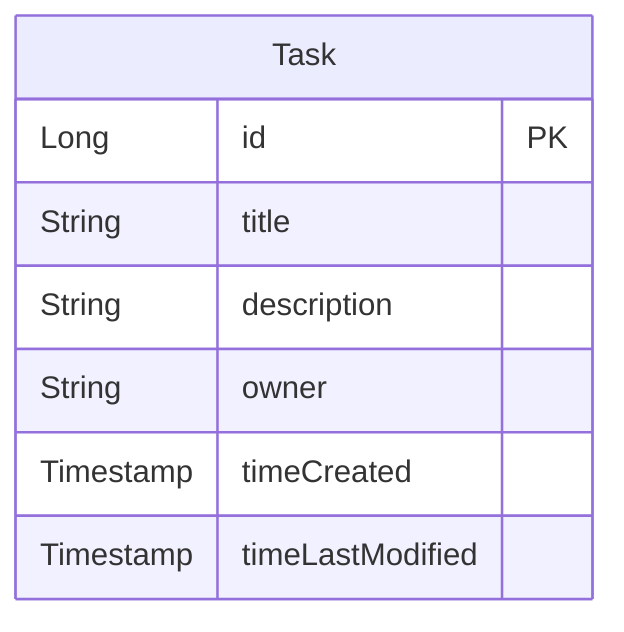

# T o d o S e r v e r V 1

# 개발 환경

| 기준  | 내용                                                                                                  |
|-----|-----------------------------------------------------------------------------------------------------|
| OS  | `Windows 11 Home 23H2`                                                                              |
| IDE | `IntelliJ IDEA 2024.1.1`                                                                            |
| SDK | 개발 언어: `Kotlin 1.9.23`(JVM: `OpenJDK 17.0.3`)<br/>프레임워크: `Spring Boot 3.2.5`<br/>빌드 툴: `Gradle 8.7` |

# 0. 목차

0. 목차
1. 요구사항
2. 고민거리
    1. 수정/삭제 API의 `request` 사용 방식
    2. RESTful API
    3. 관심사 분리
    4. API 명세서 작성 가이드라인
        1. `task` 관련 API 명세서
        2. Data Transfer Object (`DTO`)
        3. DB Table

# 1. 요구사항

- [v] 할 일 카드 작성
    - `할 일 제목`, `할 일 내용`, `작성일`, `작성자 이름` 저장
    - 추가된 `할 일` 정보 확인 가능
- [v] 할 일 조회
    - 선택한 할 일 정보 조회
    - `할 일 제목`, `할 일 내용`, `작성일`, `작성자 이름` 포함
- [v] 할 일 목록 조회
    - 등록된 전체 할 일 목록 조회
    - 작성일 기준 *내림차순* 정렬
- [v] 할 일 수정
    - `할 일 제목`, `작성자명`, `작성 내용` 수정
    - 수정된 정보 확인 가능
- [v] 할 일 삭제
    - 선택한 할 일 삭제

# 2. 고민거리

## 2-1. 수정/삭제 API의 `request` 사용 방식

- 특정 `task`를 수정할 경우 `URL Path`에 `taskId`를 넣어 수정/삭제할 대상 지정
- `task` 수정 시 `Body` 속에 `DTO` `UpdateTaskRequest`를 보관하여 사용(`@RequestBody`)

## 2-2. RESTful API

- HTTP Method를 통해서*만* 행동을 표현하고, 그 이외의 자원/URI 경로에 대해선 모두 통일(`/api/tasks`)
- *특정* `task` 조회 및 수정 및 삭제에 대해선 바로 아래에 ID를 경로로 삽입(`/{taskId}`)

## 2-3. 관심사 분리

- `Entity`: DB에 저장할 자료
- `Repository`: `Entity`에 접근하기 위해 사용
- `Service`: 실질적인 `Task` 추가/조회/수정/삭제 내용 구현
- `Controller`: 서버에 들어오는 요청에 대해 대응

## 2-4. API 명세서 작성 가이드라인

### 2-4-1. `task` 관련

| Feature     |   Method | URL                   | Request (body)      | Response             |
|-------------|---------:|-----------------------|---------------------|----------------------|
| 할 일 추가      |   `POST` | `/api/tasks`          | `CreateTaskRequest` | `TaskResponse`       |
| 할 일 조회 (목록) |    `GET` | `/api/tasks`          | -                   | `List<TaskResponse>` |
| 할 일 조회      |    `GET` | `/api/tasks/{taskId}` | -                   | `TaskResponse`       |
| 할 일 수정      |  `PATCH` | `/api/tasks/{taskId}` | `UpdateTaskRequest` | `TaskResponse`       |
| 할 일 삭제      | `DELETE` | `/api/tasks/{taskId}` | -                   | -                    |

- *특정* 할 일(`Task`)을 조회할 때 `taskId`가 존재하지 않을 경우 `ItemNotFoundException` 발생
- 할 일 수정 시(`PATCH /api/tasks/{taskId}`) 수정사항이 없을 경우 **DB에 변경사항을 저장하지 않음**
    - `timeUpdated` 갱신을 막기 위함

### 2-4-2. Data Transfer Object (`DTO`)

#### 2-4-2-1. `CreateTaskRequest`

할 일 추가 시(`POST /api/tasks`) `body`에 추가하는 내용

```kotlin
data class CreateTaskRequest(
    val title: String,          // 추가할 할 일의 제목
    val description: String,    // 추가할 할 일의 본문
    val owner: String           // 추가할 할 일의 소유자
)
```

#### 2-4-2-2. `UpdateTaskRequest`

할 일 수정 시(`PATCH /api/tasks`) `body`에 추가하는 내용

```kotlin
data class UpdateTaskRequest(
    val title: String,          // 수정할 할 일의 제목
    val description: String,    // 수정할 할 일의 본문
    val owner: String           // 수정할 할 일의 소유자
)
```

#### 2-4-2-3. `TaskResponse`

할 일(`task`)에 대해 CRU~~D~~ 진행 시 보내는 응답

```kotlin
import java.time.LocalDateTime

data class TaskResponse(
    val id: Long?,                      // 할 일의 ID
    val title: String,                  // 할 일의 제목
    val description: String,            // 할 일의 본문
    val owner: String,                  // 할 일의 소유자
    val timeCreated: LocalDateTime?,    // 할 일을 추가한 시각
    val timeUpdated: LocalDateTime?     // 할 일을 마지막으로 수정한 시각
)
```

### 2-4-3. DB Table

